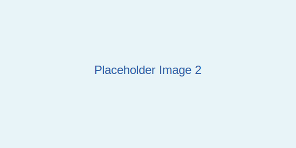
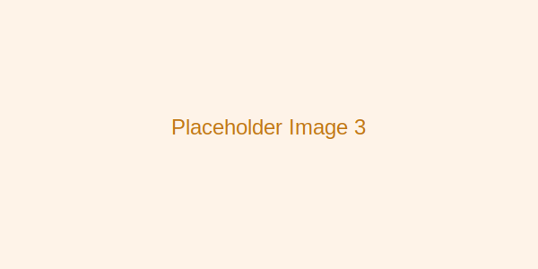

## Introduction

This article demonstrates the new figure and caption system inspired by Distill.pub. The fragment system has been removed in favor of a cleaner, more semantic approach using HTML5 `<figure>` and `<figcaption>` elements.

## Basic Figure Example

Here's a simple figure with a caption:

<figure>
  
  <figcaption>
    Figure 1: A simple example figure with a descriptive caption. Captions should explain what the reader is looking at and why it matters.
  </figcaption>
</figure>

The figure element provides semantic structure for images and their captions.

## Interactive Visualization Container

For TypeScript-powered visualizations, you can use a div with an ID inside a figure:

<figure class="fullwidth">
  <div id="interactive-example" class="viz-container">
    <p>Interactive visualization will be rendered here by TypeScript</p>
  </div>
  <figcaption>
    Figure 2: An interactive visualization container. TypeScript code in src/ can target this by ID to create dynamic visualizations using D3.js or other libraries.
  </figcaption>
</figure>

## Multiple Figures

You can have multiple figures in sequence:

<figure>
  
  <figcaption>
    Figure 3a: The first part of a comparison visualization.
  </figcaption>
</figure>

<figure>
  
  <figcaption>
    Figure 3b: The second part showing contrasting behavior.
  </figcaption>
</figure>

## Full-Width Figures

Use the `fullwidth` class for larger visualizations:

<figure class="fullwidth">
  <div id="large-viz" class="viz-container" style="height: 400px; display: flex; align-items: center; justify-content: center; background: linear-gradient(135deg, #667eea 0%, #764ba2 100%);">
    <p style="color: white; font-size: 1.5rem; text-align: center;">Large interactive visualization area<br><small style="opacity: 0.8;">Perfect for complex charts and graphs</small></p>
  </div>
  <figcaption>
    Figure 4: A full-width figure that can accommodate larger, more complex visualizations. This is ideal for detailed charts or interactive explorations that need more space.
  </figcaption>
</figure>

## Benefits of This Approach

1. **Semantic HTML**: Using proper `<figure>` and `<figcaption>` elements
2. **TypeScript Support**: Write type-safe visualization code in `.ts` files
3. **CSS Flexibility**: Style figures consistently across articles
4. **No Fragment System**: Cleaner, more maintainable article markdown
5. **Accessibility**: Screen readers understand figure/caption relationships

## How It Works

### For Static Images

```html
<figure>
  
  <figcaption>Caption text here</figcaption>
</figure>
```

### For Interactive Visualizations

1. Add a div with unique ID in your markdown:
```html
<figure>
  <div id="my-viz"></div>
  <figcaption>Caption for interactive viz</figcaption>
</figure>
```

2. Create a TypeScript file in `src/visualizations/my-viz.ts`:
```typescript
export function initMyViz() {
  const container = document.getElementById('my-viz');
  if (!container) return;
  
  // Your D3.js or other visualization code here
}
```

3. Import and call in `src/index.ts`:
```typescript
import { initMyViz } from './visualizations/my-viz';

window.addEventListener('DOMContentLoaded', () => {
  initMyViz();
});
```

## Conclusion

This system provides a clean, standards-based approach to incorporating figures and visualizations in articles, with full TypeScript support for interactive content.
