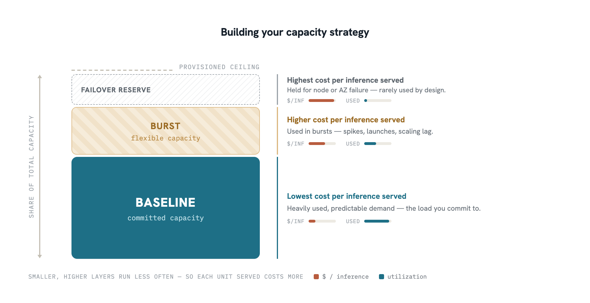
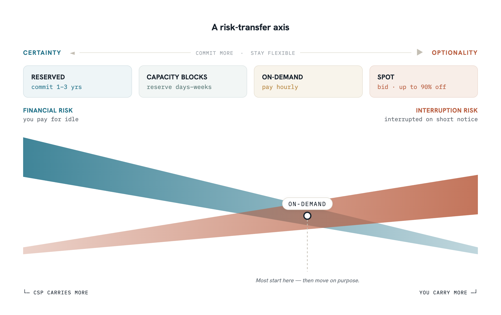
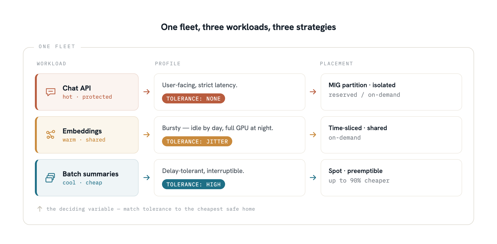

The demo worked.

That was the problem.

In a four-person startup, "it works" is enough to get you to launch. The model answers fast on one GPU. The graphs look great. Everyone knows there are rough edges, but that is tomorrow's problem.

Then tomorrow shows up all at once.

A customer sends a longer prompt. Another opens three tabs. Europe wakes up earlier than expected. Latency jumps. One GPU is slammed, another is idle, and nobody can tell whether the problem is batching, routing, cold starts, or the fact that the team bought just enough capacity to feel responsible and not enough to feel safe.

The founding engineer says, "We need more baseline capacity."

The person watching the budget says, "With what money?"

The ML engineer says, "More capacity will not fix bad workload placement."

The worst part is that all three are right.

That is when production capacity stops being a spreadsheet and becomes an operating problem. Not "how many GPUs do we need," but "what has to be fast, what can wait, what can share hardware, and what will break the moment real traffic stops being polite."

This article is about that problem. We will walk through why production capacity is harder than it looks, the questions you need to answer before you buy anything, and concrete strategies for acquiring capacity, using it efficiently, and changing it safely when you need to. If you are moving from a prototype to production, or if you are already in production but burning money on underutilized hardware, this is where to start.

## Why Production Capacity Is Its Own Problem

Most teams first encounter capacity as a procurement problem. They need some number of GPUs, they figure out which ones, and they go get them. That framing holds up until real traffic arrives. Then it becomes clear that capacity is not just something you acquire. It is something you shape, protect, and spend in service of latency, uptime, and user experience. That is especially true in inference systems, where traffic is bursty, hardware is expensive, and the wrong decision can show up as queueing delay long before it shows up as a hard outage.

Three tensions sit underneath almost every capacity decision.

**Commitment versus flexibility.** Committed capacity buys predictability. It lowers the risk that you will be caught short during a launch, a traffic spike, or a regional failover. But commitment is also a bet: on demand, on model mix, on growth, and on how long today's architecture will still be the right one six months from now. Flexibility gives you room to adapt, but it also leaves you more exposed to price volatility, provisioning delays, and the simple fact that spare capacity is hardest to find exactly when everyone else needs it too.

**Isolation versus density.** Isolated capacity is easier to reason about: one workload, one pool, one performance profile. Dense capacity looks better on paper. Shared fleets, sliced GPUs, and mixed utilization can drive much higher efficiency out of very expensive hardware. But density has a cost, and the nature of that cost depends on which level you are operating at. At the physical level, when workloads share a single GPU or node, they compete directly for compute units, memory bandwidth, and cache, making the noisy neighbor problem acute and hard to isolate.<d-cite key="predictableServing2025"></d-cite> At the orchestration level, containerized workloads distributed across a shared fleet, including across availability zones or regions, can sidestep most physical contention, but scheduling mistakes and resource limits still matter. The right architecture can make fleet-level sharing safe; physical-level sharing requires more deliberate isolation to keep latency predictable.

**Uniformity versus heterogeneity.** Uniform fleets simplify everything. Procurement is simpler, scheduling is simpler, deployments are simpler, and operational knowledge compounds in one place. But inference workloads are rarely uniform for long. A low-latency chat path, an embeddings service, an overnight batch job, and a larger reasoning model do not all want the same hardware profile or the same scaling behavior. Heterogeneity lets you match the right accelerator to the right workload, and in more advanced systems even split different stages of inference across different hardware. The tradeoff is operational complexity: more SKUs, more scheduling logic, more failure modes, and more ways to misplace capacity. Heterogeneity also improves cost efficiency and availability: the right accelerator for each workload costs less per inference, and a fleet that spans multiple GPU types is less exposed to supply shortages of any single SKU.<d-cite key="heteroGpuServing2025"></d-cite>

This is why production capacity is not a procurement exercise alone. Procurement decides what supply is available to you. Capacity planning decides which promises that supply is meant to keep. The real question is not "How many GPUs should we buy?" It is "What must always be fast, what can wait, what can share hardware, and what are we willing to reconfigure under pressure?" Those are reliability and performance questions first and purchasing questions second.

Back at the startup, none of this was obvious when the demo worked. The team had one GPU, one model, and one workload. The tensions above were invisible because everything was the same: same hardware, same traffic pattern, same team, same risk tolerance. Production is when those assumptions shatter into pieces, and you realize each piece needs a different answer.<d-cite key="awsGpuCostOpt"></d-cite>

## Questions to Answer Before You Buy

A little homework pays for itself in procurement speed. A team that can articulate exactly what it needs, when it needs it, and how long it needs it for will move through a capacity conversation with a CSP in weeks rather than months. So before you acquire capacity, decide what problem you are trying to solve. Capacity decisions harden quickly. Once you commit to a fleet shape, a purchasing strategy, or an operating model, it becomes much harder to change course without cost, migration work, or user pain.

**Start with traffic shape.** Is demand steady, peaky, diurnal, launch-driven, or wildly unpredictable? A workload with a calm weekday baseline and short evening spikes wants a very different strategy than one driven by batch jobs, customer cron schedules, or sudden product virality. If you do not understand when load arrives, how sharply it rises, and how long it stays elevated, you are not planning capacity yet. You are guessing.

**Next is latency budget.** Some workloads need responses to feel immediate. Others can tolerate queueing, retries, or delayed completion as long as throughput stays high. That distinction changes everything. A real-time assistant forces you to care about headroom, cold-start behavior, and placement close to users. An asynchronous pipeline can trade speed for efficiency much more aggressively. Many teams formalize this as a Service Level Objective (SLO): a specific numerical target for Time to First Token (TTFT), Time per Output Token (TPOT), or p99 end-to-end latency, which then drives hardware provisioning and admission control decisions downstream.<d-cite key="fregly2025"></d-cite><d-cite key="huyen2024"></d-cite>

**Model choice.** Many teams think they are planning for "the model," when they are really planning for several very different services sharing a budget and an infrastructure surface area. A small fast model for chat, a larger model for premium reasoning, an embeddings service, and a batch summarization pipeline may all coexist in the same product. If you treat them as one capacity problem, you will either overbuild for the easy workloads or under-protect the critical ones.

**Planning horizon matters.** Some capacity needs are predictable months in advance. Others only become visible week to week, or even hour to hour. The longer your confidence window, the more aggressively you can commit. The shorter it is, the more valuable flexibility becomes. Long-horizon certainty rewards commitment. Short-horizon uncertainty rewards optionality.

**Operational maturity is just as important as demand.** A small team can support less complexity than a larger, more experienced platform organization, even if both teams want the same end state. A clever fleet strategy that your team cannot monitor, debug, or safely change is not sophistication. It is deferred downtime.

**Define your failure model before you size anything.** Are you planning for a single node failure, an availability zone event, a bad rollout, a regional failover, or all of the above? The answer determines how much spare capacity is truly available versus already spoken for. Many teams think they have utilization headroom until the day they need that same headroom to absorb a failure.

The startup in our story did not ask any of these questions before launch. They sized for average traffic, assumed autoscaling would cover the rest, and never defined what failure looked like. The night the product was featured in a newsletter and traffic doubled in twenty minutes, they discovered that their answers to all six questions were either wrong or missing. The GPU that was "idle" was actually handling retries from a different endpoint. The "spare" headroom had already been spent absorbing a flaky node. The autoscaling event fired correctly but the new node took nine minutes to come online.

If these questions feel upstream of procurement, that is the point. Get them right first, and the purchasing strategy becomes much clearer.<d-cite key="awsRightSizing"></d-cite>

## Building Your Capacity Strategy

Do not build production capacity as a single bet. Build it as a portfolio.

Some demand is real, recurring, and boring. Commit to that. Some demand is spiky, uncertain, or tied to growth and failures. Layer flexibility on top. The mistake is not choosing reserved over spot or spot over reserved. The mistake is pretending your whole workload has the same shape.

That is what "baseline plus burst" really means: protect the traffic you know about, and leave room for the traffic that shows up anyway.

**Baseline** is the capacity you expect to need during ordinary operation, plus enough margin that small swings do not immediately turn into queues. It is the load you trust enough to protect on purpose.

**Burst** exists to absorb demand that arrives faster than your fleet can react: sharp spikes, launches, regional imbalance, and the minutes between "traffic is rising" and "new capacity is actually serving." In inference systems, that lag matters. Cold starts, spare capacity, and scaling speed all shape whether users experience fast responses or waiting.

**Failover reserve** is the capacity you are not really free to spend, because it already has a job during a bad day. If a node dies, a zone degrades, or one region has to absorb traffic from another, reserve capacity becomes survival capacity. Many teams discover this too late, when the capacity they assumed was headroom turns out to be load they were already carrying.

A simple rule of thumb:

- Baseline protects the traffic you see often.
- Burst protects the traffic that arrives suddenly.
- Reserve protects the traffic you still need to serve when part of the system stops cooperating.

<figure class="fullwidth">
  
  <figcaption>Commit the boring baseline. Rent the burst. Never spend the cap.</figcaption>
</figure>

The startup had none of these distinctions. They had one pool of capacity and hoped it would stretch. After the newsletter incident, they did the baseline-plus-burst exercise for the first time. They pulled 30 days of traffic data, plotted the diurnal curve, identified the overnight trough as their true baseline, and realized they had been over-provisioning for burst while leaving their actual baseline unprotected during regional events. The fix was not buying more capacity. It was reshaping the capacity they already had. And because they were no longer over-provisioning for burst while leaving their baseline exposed, their monthly spend dropped as well. Reliability improved. The bill shrank. Both happened from the same change.<d-cite key="dynamoLLM2025"></d-cite><d-cite key="awsStaticStability"></d-cite>

## The Purchasing Spectrum

Once a team accepts that capacity is a portfolio, the next question is how to source each layer of that portfolio.

Before stepping through the options, it helps to understand why there are so many of them. Each pricing model reflects a different answer to one question: who absorbs the risk? GPU hardware is expensive, supply-constrained, and demand for it is unpredictable. Cloud providers cannot make it infinitely available for free. So, they offer a spectrum of options that shift financial risk, availability risk, and operational risk between themselves and their customers. When you commit to reserved capacity, the provider guarantees your hardware is ready; you absorb the cost whether you use it or not. When you use spot, the provider offloads idle capacity to you at a discount; you absorb the interruption risk. Understanding this transfer helps you make deliberate choices rather than defaulting to on-demand for everything.

<figure class="fullwidth">
  
  <figcaption>You can't hold zero risk — only choose which kind. Where does each of your workloads sit?</figcaption>
</figure>

Think of the purchasing spectrum as a tradeoff between certainty and optionality. On one end, you pay for stronger guarantees: more confidence that capacity will be there when you need it, more predictability in cost, and fewer surprises during a launch or a failure event. On the other end, you pay for flexibility: the ability to adapt as traffic changes, models evolve, and your understanding of the workload becomes more real and less hypothetical.

A practical way to think about the spectrum:

- **Reserved capacity** is for demand you are confident will exist. Multi-year commitments offer the steepest discounts and the strongest availability guarantees, at the cost of flexibility. They usually require an upfront payment, and the cost runs whether or not you actually use the capacity.
- **Shorter-term committed blocks** fit planned events, migrations, model launches, and other known periods of elevated need. They sit between a long-term reservation and pure on-demand and usually require an up-front payment.
- **On-demand capacity** covers uncertainty without forcing a long commitment. It is more expensive per hour, but it does not require a forecast you do not yet have.
- **Spot or preemptible capacity** is best for work that is price-sensitive and resilient to disruption. Up to 90% cheaper than on-demand, but the cloud provider can reclaim it with short notice.

The rule is not "pick one." The usual pattern is baseline plus burst: commit to enough capacity to protect the product on an ordinary day, and layer more flexible capacity on top for spikes, experiments, and the mistakes you have not discovered yet. That is the difference between buying capacity and designing a fleet.

**Spot for inference is more viable than most teams think.** Conventional wisdom says spot is for training, not serving. That is changing. For stateless inference, where each request is independent and carries no session state, an interruption is a routing problem, not a data loss problem. A load balancer that drains connections gracefully and health checks that detect preemption quickly make spot viable for many workloads. For latency-tolerant inference such as batch embeddings, async summarization, and offline document processing, spot can be a massive cost lever.

The key question is interruption tolerance. Map it to your SLA tier. Some workloads can absorb a two-minute preemption notice and reroute cleanly. Others cannot. Know which is which before you commit to a spot-heavy strategy.

After the newsletter incident, the startup started treating capacity in layers for the first time. They committed to a reserved baseline covering their overnight trough. They added on-demand capacity for their weekday peak. And they moved their nightly embedding regeneration job, previously running on the same fleet as the chat API, onto spot instances at a fraction of the cost. Total spend went down. Reliability went up. The insight was not a new tool. It was recognizing that three different workloads had three different risk profiles and had been treated as one.

**Automating your capacity layer.** Most cloud providers expose pricing and availability data through APIs, so capacity decisions do not have to be static. You can query real-time spot prices, monitor interruption rates by instance type, and build fallback logic that shifts workloads between spot and on-demand when conditions change. Short-term capacity blocks, which can run from a single day up to eight weeks, can be reserved programmatically as part of a launch or campaign runbook rather than as a one-off manual step. The more you treat capacity procurement as a system, with automated fallback, scheduled blocks for predictable events, and real-time spot price awareness, the less you are caught making expensive last-minute decisions under pressure.<d-cite key="awsCapacityBlocks"></d-cite><d-cite key="spotServe2024"></d-cite><d-cite key="awsSpotBestPractices"></d-cite>

## Capacity Slicing Inside a Node

Purchasing is how you get capacity. Slicing is how you use it.

Capacity slicing is what teams do when one accelerator is too expensive to leave half-used but too valuable to dedicate blindly. The question is not whether you can subdivide a GPU. It is whether the efficiency gain is worth the loss of isolation.<d-cite key="wangHu2026"></d-cite>

Modern GPUs are large, powerful, and frequently underutilized in inference workloads. A 7B parameter model running on an H100 occupies a fraction of what the hardware can do. Slicing lets you run more workloads on the same physical chip, which lowers your cost per inference and raises the utilization of expensive hardware. But every form of slicing involves a tradeoff between efficiency and isolation. The tradeoff is manageable once you understand which workloads need isolation and which can share. Start there.

**Hardware partitioning.** Multi-Instance GPU (MIG) technology, available on NVIDIA A100, H100, and H200 chips, creates hard partitions inside a single GPU. Each partition gets its own dedicated compute units, memory bandwidth, and L2 cache. Crucially, failures are contained: one partition crashing does not affect the others. This is the most predictable option. It is useful when you need clean isolation between workloads, when you want latency to stay stable, or when you need a clear answer during an incident about which workload is behaving badly and which is not. The tradeoff is that MIG partitions come in fixed profiles. You cannot create arbitrary sizes, and you lose some aggregate throughput compared to using the full GPU as one unit.

**Temporal multiplexing (time-slicing).** Multiple workloads take turns on the same GPU in rapid succession. Each one sees what looks like a dedicated device, but is actually getting time-sliced access. There is no hardware isolation: workloads share the same memory space and the same fault domain. This is much more flexible than MIG, you can create any number of virtual GPUs with no fixed profiles, but latency becomes harder to reason about when one workload gets busy and the others start waiting. Time-slicing is attractive when demand is uneven and the alternative is paying for idle hardware. It works best for workloads that are batch-oriented, tolerant of jitter, or easy to pause and retry. Time-slicing predates MIG and lacks its hardware isolation, but it remains a practical option for workloads tolerant of jitter. If you need strict per-workload guarantees, use MIG. If you need density without strict latency requirements, time-slicing still works.

**Concurrent execution.** NVIDIA's Multi-Process Service (MPS) allows multiple CUDA processes to execute kernels on the GPU simultaneously, which means actual overlap rather than time-sharing. This improves throughput for compatible workloads and reduces the context-switching overhead that comes with time-slicing. There is some memory isolation through separate address spaces, but the fault domain is still shared. MPS works best for workloads that individually use very little of the GPU and genuinely benefit from running at the same time.

| | MIG | Time-Slicing | MPS |
|---|---|---|---|
| **Isolation** | Hardware-level | None | Partial |
| **Flexibility** | Fixed profiles | Any split | Any split |
| **Max density** | 7 partitions per GPU | 50+ per GPU | Varies |
| **Failure blast radius** | Per partition | Full GPU | Full GPU |
| **Best for** | Multi-tenant, latency-sensitive | Homogeneous models, batch work | Low-utilization concurrent workloads |

The rule of thumb is simple: if the workload is user-facing, latency-sensitive, or likely to create noisy-neighbor incidents, preserve isolation first and optimize later. If the workload is batch-oriented, tolerant of jitter, or easy to pause and retry, maximize utilization more aggressively. Slicing works. The key is matching the right technique to the right workload: use MIG where you need isolation, time-slicing where you can tolerate sharing, and start with the workloads where the cost savings are obvious.

<figure class="fullwidth">
  
  <figcaption>Three different risk profiles, treated as one — until they weren't.</figcaption>
</figure>

Six months after the newsletter incident, the startup had grown its model portfolio to three services: a real-time chat API, an embeddings endpoint used by search, and a nightly batch job for document summaries. All three were running on the same fleet. The chat API was well-protected. The embeddings endpoint was mostly idle during the day but consumed an entire GPU at night. The batch job ran whenever it could get time. The team moved the chat API to MIG-partitioned hardware with dedicated slices, ensuring it would not compete with anything. They moved the embeddings endpoint to time-sliced hardware shared with a second low-traffic service, raising overall GPU utilization significantly. The batch job stayed on spot. Three workloads, three different strategies, one coherent fleet.<d-cite key="eksAimlCompute"></d-cite><d-cite key="awsTimeSlicing"></d-cite>

## Heterogeneous Fleets and Workload Placement

One of the easiest mistakes in production inference is treating every workload like it belongs on the same fleet.

A low-latency chat request, an embeddings call, and an overnight batch job are all "inference," but they are not the same capacity problem. One is user-facing and unforgiving. One is usually small and repetitive. One can tolerate delay if the price is right. If you run all three on the same hardware with the same scheduling assumptions, you usually end up with expensive nodes doing inexpensive work and critical paths competing with traffic that could have waited.

That is the case for heterogeneous fleets. Put the latency-sensitive workloads on the hardware and serving path that protect responsiveness. Put the throughput-oriented or delay-tolerant workloads on capacity that is cheaper, more flexible, or easier to interrupt. Keep the premium path premium and stop letting background work sneak into it just because it is convenient.

For startups, this matters because hardware decisions are product decisions in disguise. If everything shares the same fleet, every workload inherits the same cost structure and the same failure behavior. If the chat path gets noisy neighbors from a batch job, users do not care that the cluster is efficient. They just see a slow product.

**Disaggregated inference.** The advanced version of this idea is separating not just workloads, but stages within a single inference request. LLM inference has two distinct phases: prefill, which processes the full input prompt and is compute-intensive, and decode, which generates tokens one at a time and is memory-bandwidth-intensive. These phases have genuinely different hardware preferences. Prefill wants raw compute. Decode wants high memory bandwidth and fast access to the KV cache.<d-cite key="vllm2023"></d-cite>

Disaggregated inference systems place these two phases on different hardware, matching each to what it needs. The result can be significantly higher throughput at lower cost, and better protection of the latency-sensitive decode path from interference by heavy prefill work. This is powerful, but it is also a complexity tax. It requires state transfer between machines, tighter orchestration, and more failure modes to reason about.

For a small team, the guidance is straightforward:

- Start with a heterogeneous fleet only when workload differences are already hurting cost or latency in a visible way.
- Move to disaggregated inference only when the gain is large enough to justify the extra routing, scheduling, and debugging overhead.
- Do not adopt a multi-fleet design because it looks architecturally elegant.

Uniformity buys simplicity. Heterogeneity buys fit. Disaggregation buys even more fit, but only after the team is ready to operate the additional moving parts.

A year after launch, the startup's model portfolio had grown again. They now had a premium tier running a larger reasoning model alongside the original chat API, embeddings, and batch summaries. They introduced their first heterogeneous change: a separate node pool for the premium tier with a different accelerator shape, sized for the larger model and configured to never share resources with anything else. The rest of the fleet stayed uniform. That one change reduced the premium tier's tail latency by more than they had expected, because it was no longer occasionally competing with embedding bursts. They had not adopted a full disaggregated architecture. They had just stopped pretending that four different workloads belonged on the same hardware.<d-cite key="awsRufusTrainium"></d-cite><d-cite key="splitwise2024"></d-cite><d-cite key="distServe2024"></d-cite>

## Rolling Out Capacity Changes Safely

Changing capacity sounds harmless until it happens in production. A new instance family, a different GPU shape, a more aggressive packing strategy, or a fleet rebalance can all look like cost or efficiency wins right up until they land on real traffic and turn into latency regressions, queue growth, or confusing partial failures.

For a small team, the safest rule is: never change capacity everywhere at once. Roll it out the way you would roll out a risky product change. Start with one workload, one fleet slice, or one region. Watch the metrics that users actually feel: queue depth, time to first token, tail latency, error rate, and recovery behavior. Not just average utilization.

A practical startup sequence:

- **Canary the change first.** Route a small percentage of traffic to the new capacity shape before trusting it broadly. Different accelerators can produce subtly different numerical outputs. Verify correctness before you scale.
- **Use shadow or replay traffic when you can.** It is cheaper to learn that a new fleet behaves differently before your customers do.
- **Define rollback triggers in advance.** If p99 latency, queue time, or error rate crosses a threshold, revert without debate. Decide the thresholds before the change goes in, not during the incident.
- **Drain before you cut over.** Do not strand in-flight requests just because the new fleet looks healthy.
- **Pre-warm before routing traffic.** New GPU nodes need time to load model weights. A cold node accepting live traffic before models are loaded is a source of slow requests that are hard to diagnose.
- **Roll region by region.** Preserve the safety margin that your multi-region setup is supposed to provide. Spend that margin on failure absorption, not on rolling out changes in parallel.

The startup learned this the hard way. They switched to a new GPU shape for their embeddings endpoint, validated it in staging, and cut over the whole fleet in one step. Staging had not exposed a subtle difference in numerical precision that caused embeddings to shift slightly. Search quality degraded within hours. They caught it from user feedback, not monitoring. Rolling back took longer than it should have because they had already drained the old fleet. The rollout itself was the incident.

After that, they implemented a simple rule: any capacity change gets a canary phase of at least twenty-four hours with rollback triggers defined before the change ships. It slowed down capacity work slightly. It prevented two subsequent incidents entirely.<d-cite key="awsSafeDeployment"></d-cite><d-cite key="awsAvoidingFallback"></d-cite>

## When Simplicity Wins

There is a point in every infrastructure conversation where the "better" design becomes the worse decision. More fleet types, more slicing strategies, more purchasing layers, more routing logic, more optimization passes: each can be justified individually. Together, they can become a system the team spends more time managing than benefiting from.

Simplicity should remain an explicit option, not a failure of ambition.

A simple approach usually wins when:

- Traffic is still too uncertain to commit against confidently.
- One or two workloads dominate the product.
- The team is small enough that operational overhead is the real bottleneck.
- Reliability problems are coming from basics (monitoring, autoscaling, deployment safety, queueing) before they are coming from fleet sophistication.
- You have not yet earned the complexity of heterogeneous fleets or aggressive slicing.

For startups, that often means doing the boring thing on purpose: fewer fleet shapes, clearer isolation, more obvious headroom, less cleverness per GPU. Complexity can be added later. It is much harder to subtract complexity from a system that is already failing in production.

The startup in this story ended up with a moderately sophisticated setup: a reserved baseline, on-demand burst capacity, spot for batch work, MIG-partitioned hardware for the latency-sensitive premium tier, and a second node pool for the larger reasoning model. That is more complex than where they started. But each layer was added after a specific problem made the need undeniable, not before. The team could explain exactly why each piece existed. Nobody had built something they could not operate.

That is the right end state. Not the most sophisticated possible fleet, but the simplest fleet that actually solves the problems you have.

## Where to Go From Here

This article covered how to think about production capacity, how to acquire it as a portfolio rather than a single bet, how to extract more from each node, how to match hardware to workload, and how to change any of it without creating new incidents.

The companion article, [Global Inference Serving](https://day1inference.com/global-inference-serving/)<d-cite key="globalInferenceServing"></d-cite>, covers the layer above capacity: how to distribute your fleet across regions, route traffic to the right endpoint, and design for global availability and fast failover. The two articles are meant to be read together. Capacity determines what supply you have. Serving architecture determines how well you spend it.

If you are starting from scratch: pick one model, one accelerator type, and on-demand pricing. Get your serving pipeline, monitoring, and SLOs right in one place. Then layer in commitments as traffic stabilizes, slicing as utilization data reveals waste, and heterogeneity as your model portfolio grows. The startup in this story took several months to get from a single GPU to a thoughtfully layered fleet. They did not regret waiting to add complexity. They regretted every time they added it before they were ready.
